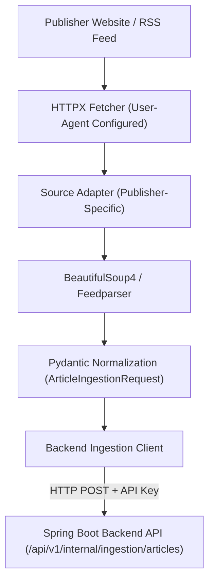

# Sri Lankan Multilingual News Intelligence Platform

A full-stack multilingual news intelligence platform for Sri Lankan news that collects reports from multiple publishers, processes and enriches them, groups related publisher reports into real-world Story clusters, supports English/Sinhala/Tamil experiences, and provides search, reporting-activity trending, coverage comparison, timelines, grounded Story Q&A, personalization, notifications, privacy-conscious analytics, and operational administration.

The system is composed of three independently maintained services:

- **Next.js Frontend** — reader, account, personalization, and admin experiences
- **Spring Boot Backend** — APIs, persistence, processing, Story intelligence, search, AI orchestration, authentication, notifications, and analytics
- **Python Ingestion Service** — publisher discovery, extraction, and scheduled ingestion

---

## Ingestion Service Repository

This repository contains the Python-based automated extraction and ingestion service (`sri-lanka-news-ingestion`). It discovers news reports from Sri Lankan news publishers, extracts metadata and internal body content, normalizes canonical URLs, and securely submits standardized Article payloads to the Spring Boot backend.

> **CRITICAL ARCHITECTURAL BOUNDARY**:
> The Ingestion Service **NEVER** writes directly to MongoDB or Redis. All discovered articles are submitted to the Spring Boot backend via its protected internal ingestion REST API.

---

## Table of Contents

- [Responsibilities](#responsibilities)
- [Important Architectural Rule](#important-architectural-rule)
- [Technology Stack](#technology-stack)
- [Ingestion Flow Diagram](#ingestion-flow-diagram)
- [Source Adapter Architecture](#source-adapter-architecture)
- [Current Publisher Support](#current-publisher-support)
- [Publisher Access Policy](#publisher-access-policy)
- [Scheduling Architecture](#scheduling-architecture)
- [Manual Runs vs. Admin Triggers](#manual-runs-vs-admin-triggers)
- [Media & Attribution Policy](#media--attribution-policy)
- [Backend Authentication](#backend-authentication)
- [Article Deduplication Responsibility](#article-deduplication-responsibility)
- [Error Handling & Resilience](#error-handling--resilience)
- [Project Structure](#project-structure)
- [Environment Configuration](#environment-configuration)
- [Running Locally](#running-locally)
- [Testing & Quality Verification](#testing--quality-verification)
- [Adding a New Publisher Adapter](#adding-a-new-publisher-adapter)
- [Copyright & Ethical Collection](#copyright--ethical-collection)
- [Related Repositories](#related-repositories)

---

## Responsibilities

- **Publisher Discovery**: Monitors publisher RSS feeds and HTML listings to detect newly published news reports.
- **Content & Metadata Extraction**: Extracts headline titles, publication timestamps, authors, topic tags, lead image URLs, and body paragraphs using publisher-specific HTML parsers.
- **URL Canonicalization**: Strips tracking parameters, referral query strings, and protocol inconsistencies to ensure clean canonical identifiers.
- **Standardized Payload Normalization**: Translates raw publisher structures into validated Pydantic models (`ArticleIngestionRequest`).
- **Backend Submission**: Delivers normalized payloads to the Spring Boot backend over HTTP with `X-Ingestion-API-Key` authentication.
- **Scheduled Ingestion**: Executes background cron-like ingestion jobs using APScheduler with bounded concurrency and jitter.

---

## Important Architectural Rule

```
[ News Publisher Websites / RSS ]
               ↓
    [ Python Ingestion Service ]
               ↓  (HTTP POST + X-Ingestion-API-Key)
    [ Spring Boot Backend API ]
               ↓
    [ MongoDB Atlas / Processing Queue ]
```

The ingestion service operates purely as a discovery and extraction pipeline. It possesses no direct database connections or administrative persistence rights. Spring Boot remains the sole authoritative service for database writes and deduplication.

---

## Technology Stack

- **Runtime**: Python `3.12+`
- **HTTP Client**: HTTPX (`httpx` `>=0.28,<1`)
- **Data Validation & Settings**: Pydantic Settings (`pydantic-settings` `>=2.10,<3`)
- **HTML Parsing**: BeautifulSoup4 (`beautifulsoup4` `>=4.13,<5`)
- **RSS Parsing**: Feedparser (`feedparser` `>=6.0.11,<7`)
- **Scheduling**: APScheduler (`apscheduler` `>=3.10,<4`)
- **Testing & Code Quality**: Pytest (`pytest` `>=8.4,<9`), Ruff (`ruff`), Mypy (`mypy`)

---

## Ingestion Flow Diagram



---

## Source Adapter Architecture

Every publisher is implemented as a dedicated `SourceAdapter` subclass inheriting from `ingestion.sources.base.SourceAdapter`.

Each adapter governs four core operations:
1. **`discover_article_urls()`**: Scrapes feed/homepage for article links within recency boundaries.
2. **`extract_article(url)`**: Downloads the individual article page and extracts title, body, date, author, and lead image.
3. **`canonicalize_url(url)`**: Transforms raw links into normalized canonical URLs.
4. **`source_slug`**: Unique string identifier matching the backend `Source` record (e.g., `daily-mirror`, `newsfirst`).

---

## Current Publisher Support

The ingestion service currently includes 7 active publisher adapters:

| Publisher Name | Source Slug | Primary Language | Ingestion Method | CLI Script Entrypoint |
|---|---|---|---|---|
| **Daily Mirror** | `daily-mirror` | English | RSS Feed + HTML Body | `ingest-daily-mirror` |
| **NewsFirst** | `newsfirst` | English | HTML Listing + HTML Body | `ingest-newsfirst` |
| **Hiru News** | `hiru-news-sinhala` | Sinhala | HTML Listing + HTML Body | `ingest-hiru-news-sinhala` |
| **Ada Derana** | `ada-derana-sinhala` | Sinhala | RSS Feed + HTML Body | `ingest-ada-derana-sinhala` |
| **The Island** | `the-island` | English | RSS Feed + HTML Body | `ingest-the-island` |
| **Divaina** | `divaina` | Sinhala | RSS Feed + HTML Body | `ingest-divaina` |
| **Lankadeepa** | `lankadeepa` | Sinhala | HTML Listing + HTML Body | `ingest-lankadeepa` |

---

## Publisher Access Policy

- **Standard HTTP Requests**: All network calls utilize standard HTTP GET requests with custom, respectful User-Agent headers (`INGESTION_HTTP_USER_AGENT`).
- **No Anti-Bot Circumvention**: Does not employ headless browser hacks, proxy rotation, or anti-bot bypass mechanisms.
- **Fetch Rate Limits & Timeouts**: Implements configurable timeouts (`INGESTION_HTTP_TIMEOUT_SECONDS`) and bounded concurrency to avoid imposing heavy loads on publisher servers.

---

## Scheduling Architecture

The service includes an automated background scheduler built on APScheduler (`ingestion.cli:main_scheduler`):

- **Cron/Interval Schedules**: Configurable per publisher adapter.
- **Jitter & Staggering**: Adds random execution jitter to prevent simultaneous HTTP requests to multiple sources.
- **Single-Instance Execution**: Employs execution locks to prevent overlapping runs if a previous run is still active.

---

## Manual Runs vs. Admin Triggers

- **CLI Manual Runs**: Developers can manually trigger one-shot ingestion for any publisher via CLI script commands (e.g., `ingest-daily-mirror`).
- **Admin Dashboard "Run Now"**: When an administrator clicks "Run Now" in the Next.js admin shell (`/admin/ingestion`), Spring Boot records an ingestion trigger event. The Python ingestion worker detects the queued job and executes the corresponding adapter.

---

## Media & Attribution Policy

- **No Local Image Storage**: Lead image URLs are referenced directly from public publisher CDN endpoints. The platform does not mirror or store publisher image files.
- **Publisher Attribution**: Every extracted article retains its original source slug, author metadata, and publisher link.

---

## Backend Authentication

All HTTP requests from the ingestion client to the Spring Boot backend must include the shared secret header:
```http
X-Ingestion-API-Key: <INGESTION_API_KEY>
```
If the API key is missing or invalid, Spring Boot responds with `401 Unauthorized` and rejects the payload.

---

## Article Deduplication Responsibility

- **Python Ingestion**: Performs URL canonicalization and in-memory deduplication within the current execution batch.
- **Spring Boot Backend**: Evaluates canonical URL hashes against MongoDB unique indexes and content signatures. If an article already exists, Spring Boot returns a duplicate status, avoiding re-processing.

---

## Error Handling & Resilience

- **Isolated Source Failures**: If an individual publisher feed or selector fails, the exception is caught and logged as a failed run. Other publisher adapters continue running unaffected.
- **Pydantic Validation**: Invalid or malformed payloads (e.g., missing titles or empty bodies) are rejected prior to network transmission.
- **Retries**: HTTP fetch operations automatically handle transient network timeouts up to configurable redirect and retry limits (`INGESTION_HTTP_MAX_REDIRECTS`).

---

## Project Structure

```
sri-lanka-news-ingestion/
├── src/ingestion/
│   ├── backend/                # Spring Boot REST client & response models
│   ├── config/                 # Pydantic environment configuration
│   ├── extraction/             # BeautifulSoup & Feedparser helpers
│   ├── http/                   # HTTPX fetcher wrapper with custom User-Agent
│   ├── models/                 # Pydantic ArticleIngestionRequest schemas
│   ├── normalization/          # Canonical URL normalization rules
│   ├── sources/                # Publisher-specific adapter implementations
│   ├── cli.py                  # CLI script entrypoints
│   ├── runner.py               # Single-shot execution pipeline
│   └── scheduler.py            # APScheduler daemon runner
├── tests/                      # Pytest unit & integration test suite
├── pyproject.toml              # Hatchling build & dependency declaration
└── README.md                   # Repository documentation
```

---

## Environment Configuration

Configure `.env` using variable names from `.env.example`:

| Environment Variable | Purpose | Default / Example |
|---|---|---|
| `INGESTION_BACKEND_BASE_URL` | Spring Boot backend base URL | `http://localhost:8080` |
| `INGESTION_API_KEY` | Shared authentication secret | `<shared-secret-with-backend>` |
| `INGESTION_HTTP_TIMEOUT_SECONDS` | HTTP request timeout in seconds | `15` |
| `INGESTION_HTTP_USER_AGENT` | User-Agent string for HTTP requests | `SriLankaNewsIngestion/0.1` |
| `INGESTION_DAILY_MIRROR_FEED_URL` | Daily Mirror RSS feed URL | `https://www.dailymirror.lk/rss/breaking_news/108` |
| `INGESTION_NEWSFIRST_LISTING_URL` | NewsFirst listing URL | `https://www.newsfirst.lk/latest` |
| `INGESTION_HIRU_NEWS_SINHALA_LISTING_URL` | Hiru News listing URL | `https://www.hirunews.lk/` |
| `INGESTION_ADA_DERANA_SINHALA_FEED_URL` | Ada Derana Sinhala RSS URL | `https://sinhala.adaderana.lk/rss.php` |
| `INGESTION_RUN_LIMIT` | Max articles fetched per run | `3` |

> **Security Warning**: Do not commit secret keys or environment files containing production API keys.

---

## Running Locally

### Prerequisites
- Python `3.12` or higher
- Virtual environment (`.venv`)

### Setup & Installation
```bash
# Clone repository
git clone https://github.com/dulanprabashwara/sri-lanka-news-ingestion.git
cd sri-lanka-news-ingestion

# Create and activate virtual environment
python -m venv .venv
# Windows:
.venv\Scripts\activate
# Linux/macOS:
source .venv/bin/activate

# Install package in editable mode with development dependencies
pip install -e .[dev]
```

### Manual Execution Examples
```bash
# Execute single-shot ingestion for Daily Mirror
ingest-daily-mirror

# Execute single-shot ingestion for NewsFirst
ingest-newsfirst

# Execute single-shot ingestion for Hiru News Sinhala
ingest-hiru-news-sinhala

# Start background scheduler daemon
ingest-scheduler
```

---

## Testing & Quality Verification

```bash
# Run pytest test suite
pytest

# Run Ruff code linter
ruff check .

# Run Mypy static type checker
mypy
```

**Verified Test Baseline**:
- `72 passed` unit & adapter tests in pytest.

---

## Adding a New Publisher Adapter

1. **Create Adapter Class**: Add a new module in `src/ingestion/sources/` inheriting from `SourceAdapter`.
2. **Implement Methods**: Define `discover_article_urls()`, `extract_article()`, and `canonicalize_url()`.
3. **Register Adapter**: Add the new adapter to `src/ingestion/sources/__init__.py` and `_adapter()` in `src/ingestion/cli.py`.
4. **Add Unit Tests**: Create mock HTML/RSS fixtures under `tests/` to verify extraction correctness.
5. **Register CLI Command**: Expose entrypoint script in `pyproject.toml`.

---

## Copyright & Ethical Collection

- Ingestion processes news metadata and content for NLP analysis, clustering, and neutral summarization.
- The service does not bypass paywalls or copy-protect mechanisms.
- All extracted content retains publisher attribution and canonical link provenance.

---

## Related Repositories

| Repository | Description |
|---|---|
| [sri-lanka-news-frontend](https://github.com/dulanprabashwara/sri-lanka-news-frontend) | Next.js 16 App Router presentation layer |
| [sri-lanka-news-backend](https://github.com/dulanprabashwara/sri-lanka-news-backend) | Spring Boot 3.5 REST API, persistence, AI orchestration & security |
